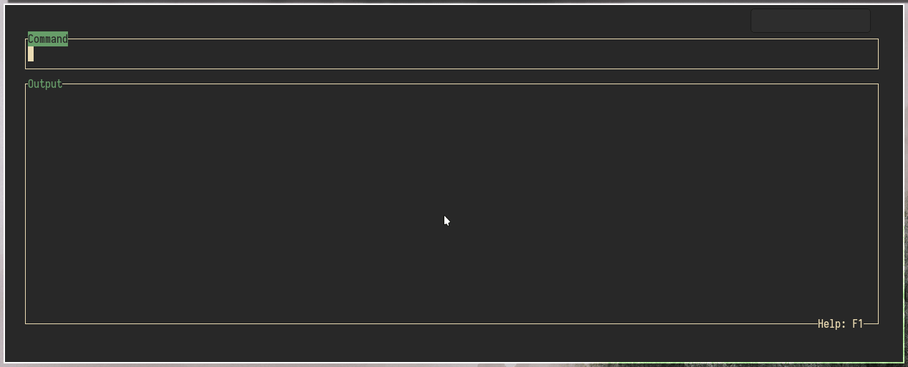

# Pipr
Pipr is a commandline pipe-building tool, written in Rust!

Pipr can automatically evaluate the pipeline you're editing in the background,
showing you the results as you go. 
This makes writing complex `sed` and `awk` chains a lot easier, 
as you'll immediately see what they do.

Because this _could_ be dangerous,
(imagine typing `rm ./*.txt` to delete all text files, 
but it already being executed at `rm ./*`, deleting all files in your working directory),
Pipr uses [bubblewrap](https://github.com/containers/bubblewrap) to execute your command
in an isolated, read-only environment, making it safe to use. I wont give any guarantees,
but you _should_ be good :D.

To allow for even more efficiency, 
Pipr features a command history and a bookmark system, 
allowing you to quickly go back to previously worked on pipelines 
or look at how you did something before.

It also features a snippet-system, allowing you to define custom snippets 
that can be inserted with the press of a button.
These can be used to insert common stuff like `sed -r 's///g'`, 
even allowing you to specify where the cursor should be placed after inserting the snippet.

You can even look up documentation and help of your commands on the fly.
Simply hover your cursor over the desired command and press `F5`.
You can then choose between different documentation-options to look at.
You can add your own options (for example [tldr](https://tldr.sh/)) in the config file
in the `[help_viewers]` section.

## Showcase


## Installing
[](https://repology.org/project/pipr/versions)

### Using the static binary
If none of the listed installation-options are available to you, 
you can simply use the static binary provided on the 
[releases page](https://gitlab.com/Elkowar/pipr/-/releases).
This _should_ work on most unix-based systems.

### Arch Linux: Using the AUR
Pipr is available on the AUR, so you can simply install it using your favourite AUR-helper:
```sh
$ yay -S pipr-git
```
or for a binary:
```sh
$ yay -S pipr-bin
```

### Using Cargo
If you have a Rust-setup and have `cargo` installed, you can install pipr using cargo:
```sh
$ cargo install pipr
```


## Usage
Just start `pipr`!

Help is available in `pipr` by pressing F1.

### Basics
You can evaluate a command by pressing enter. 

There is also the **autoeval mode**: Enabled by simply pressing `F2`, this mode runs your command after every keypress.

The textfield works like you would expect, supporting `Ctrl+A`, `Ctrl+E` to jump to the start / end of the line,
`Ctrl+U` to clear the whole text-field, and `Alt+Enter` to insert a newline.

### History and Bookmarks
Pipr keeps a history of your commands, through which you can cycle using `Ctrl+P` and `Ctrl+N`. 
You can also look at the whole History by pressing `F4`.
In autoeval mode, you're not pressing Enter that often, so pipr might loose some parts of history.
If you want to avoid that, you can enter "paranoid history mode" by pressing `F3`, 
in which Pipr will save any command that successfully runs into the history.

If you _really_ like a command you worked on, you can also *bookmark* it by pressing `Ctrl+S`.
You can look through all bookmarked commands by pressing `Ctrl+B`.

### Snippets
A lot of times, you'll type the same things over and over again, for example `awk '{print $...}'`, `sed 's/.../.../g'`.
To make this more efficient, pipr supports *snippets*: By pressing `Ctrl+V`, 
you can open a menu of all your configured snippets. Just choose one by pressing it's respective key, 
and it will be inserted at your cursor, placing your cursor where it is supposed to.
You can configure your own snippets in the config file!

### Helpviewers
Ever worked on a long pipeline, and suddenly forgot that one flag you _really_ need?
No problem, just hover your cursor over the command and press `F5`.
This will open a menu, giving you the option to open the commands help-output or man-page.
You can also configure more help-viewers in the config-file.

### Outputviewers
If you need to inspect your commands output a bit more deeply, 
pipr's built-in output window might not be sufficient.
That's not a problem, because you can open the output in a pager of your liking.
Simply press `F6` and choose your outputviewer.
These are also configurable, so you can add more specific things like [fx](https://github.com/antonmedv/fx).

### Output caching
If your command uses the output of a slow command, or maybe the result of a http-request, 
rerunning that command with every keypress might not be a good idea.
For this, you can hover over any `|` symbol and press `F7` to cache everything up to that pipe. 
This way, it will not be rerun unless you change it.

(This is especially important if you're using an external API with rate-limiting!)

### Tab completion
Well,... pipr has it. Never forget your filenames ever again!

### Configuration file
Pipr's configuration is stored in `~/.config/pipr/pipr.toml`.
You can add your own output-viewers, help-viewers, snippets and much more here. 
Also, configure things like enabling autoeval-mode by default.

If you accidentally removed something from the config, fear not: 
pipr can print out it's well-commented default config if you pass it the `--config-reference` flag.

#### Finish_hook
the finish hook (configured in the config-file) is a command that will be executed after you close pipr, 
and will get the finished bash command line piped into stdin.
This can be used to pipe your work into xclip, storing it in your clipboard, 
thus making it possible to quickly paste it into the terminal.


## Terminal integration
In the `shell_integration/` folder in this repository you'll find some scripts for different interactive shells.
These allow you to call pipr from the terminal with a simple keypress, 
inserting your current line-buffer into pipr.
If you're using fish, it will even put the final command back into your terminal's linebuffer after closing pipr.

To use these, simply put the lines from the respective file into your `.bashrc` or `config.fish` file.

__Keymappings__  
*Fish:* Ctrl+Alt+a  
*Bash:* Alt+a

## Dependencies
Pipr uses [bubblewrap](https://github.com/containers/bubblewrap)
to execute your command in an isolated environment, 
preventing most (but maybe not all, I won't give you any guarantees) dangers 
like accidentally deleting something while you're typing a command.

This means that you'll need to have bubblewrap somewhere on your `PATH`,
or you'll have to use the unsafe-mode by passing the `no-isolation` flag.
